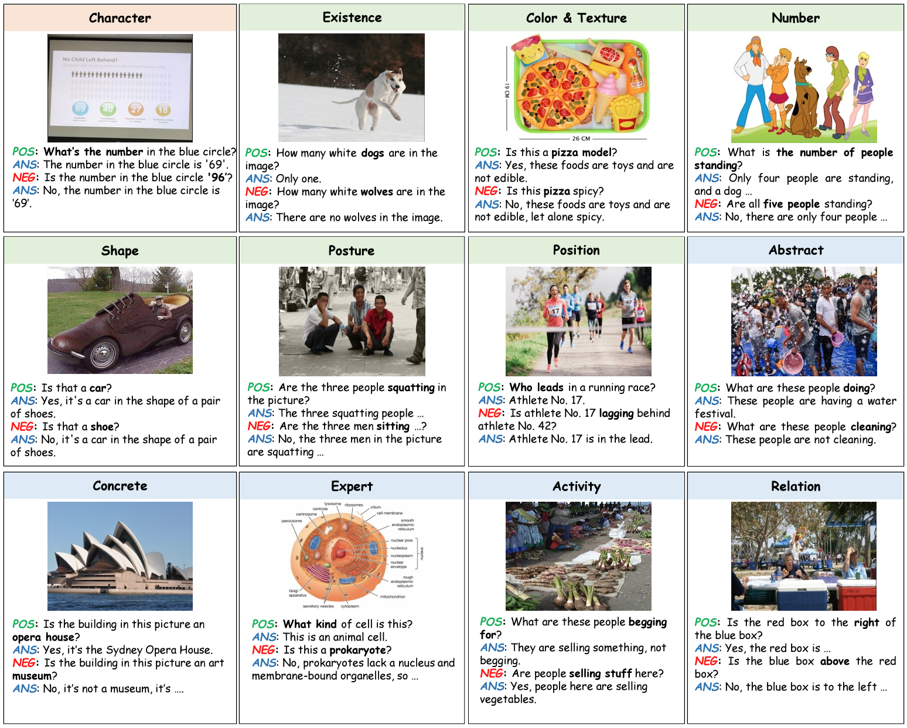
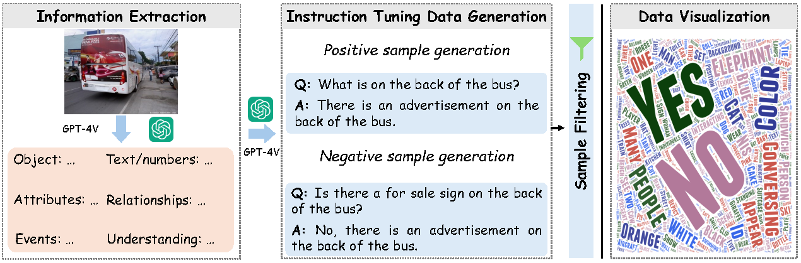

<h1 align = "center">
  Multimodal-Robustness-Benchmark
</h1>

<p align="center">
    <a href="http://arxiv.org/abs/2406.10638">
        
    </a>
    <a href="https://huggingface.co/datasets/BAAI/Multimodal-Robustness-Benchmark">
        
    </a>
    <a href="https://law1223.github.io/Multimodal-Robustness-Benchmark/">
        
    </a>
</p>

This repo contains the official evaluation code and dataset for the paper“Seeing Clearly, Answering Incorrectly: A Multimodal Robustness Benchmark for Evaluating MLLMs on Leading Questions”.

## 📢 News and Updates

* 2024.06.18 🔥 **Checkpoints are released!** Check more details in HuggingFace: [Bunny-MMR-3B](https://huggingface.co/AI4VR/Bunny-MMR-3B), [Bunny-MMR-4B](https://huggingface.co/AI4VR/Bunny-MMR-4B), [Bunny-MMR-8B](https://huggingface.co/AI4VR/Bunny-MMR-8B).
* 2024.06.18 🔥 **Paper is ready.** Check more details in [arXiv](https://arxiv.org/abs/2406.10638).
* 2024.06.17 🔥 **Demo is available.** Check more details in [link](https://law1223.github.io/Multimodal-Robustness-Benchmark/). Welcome everyone to try it!
* 2024.06.13 🔥 **MMR benchmark and MMR-data are released!** Check more details in [HuggingFace](https://huggingface.co/datasets/BAAI/Multimodal-Robustness-Benchmark).

## 📇 Contents
- [MMR-benchmark](#%EF%B8%8F-mmr-benchmark)
- [Evaluation](#-evaluation)
- [Leaderboard](#-leaderboard)
- [MMR-data](#-mmr-data)
- [Training](#-training)
- [Quickstart](#-quickstart)
- [Citation](#-citation)
- [License](#-license)
- [Acknowledgement](#-acknowledgement)

## ⚖ MMR-benchmark

Multimodal Large Language Models (MLLMs) have demonstrated impressive capabilities in visual understanding and reasoning, providing reasonably accurate answers, such as image descriptions. This has spurred extensive research into evaluating MLLMs. Most evaluation benchmarks assume that incorrect answers indicate a lack of understanding of the visual content. However, our findings reveal that, in many cases, MLLMs answer questions incorrectly despite correctly understanding the visual content. This suggests that incorrect answers do not necessarily imply a lack of comprehension but may instead result from a lack of robustness to leading questions.

To comprehensively measure MLLMs' understanding capability and robustness to leading questions, we introduce a multi-modal robustness benchmark (MMR). MMR contains paired positive and negative questions across 12 categories, meticulously annotated by humans. We manually construct 300 positive and 300 leading negative questions across three levels: character, attribute, and context. Character-level questions prompt identifying elements like characters or numbers, while attribute-level questions focus on properties such as color, texture, and quantity. Context-level inquiries delve into higher-level concepts like emotions, culture, and common sense. The positive questions aim to evaluate the model's understanding ability, while the misleading ones challenge its resistance to interference.

<p align="center">
  
</p>

## 🏁 Evaluation

Please refer to our [evaluation](https://github.com/BAAI-DCAI/Multimodal-Robustness-Benchmark/tree/dev/evaluation) folder for more details.

## 🏆 Leaderboard

| Method                          | Avg. RA ↑ | Char/Num | Pres.  | Color/Tex | Num.  | Shape | Posture | Pos.  | Abstract. | Concrete. | Expert. | Act.  | Rel. |
|---------------------------------|----------|--------|-----------|-------|-------|---------|-------|-----------|-----------|---------|-------|------|------------|
| GPT-4o 🥇                       | 69.00    | 72.50    | 68.18  | 66.67     | 45.83 | 87.5  | 70.83   | 50.00 | 68.18     | 76.19     | 70.97   | 83.33 | 63.64|
| Mini-Gemini-HD-34B 🥇           | 69.00    |62.50    | 63.64  | 70.83     | 54.17 | 79.17 | 62.50   | 72.73 | 86.36     | 85.71     | 54.84   | 19.17 | 68.18|
| LLaVA-1.6-34B 🥉                | 68.67    |75.00     | 68.18  | 66.67     | 41.67 | 79.17 | 54.17   | 72.72 | 81.81     | 71.42     | 64.52   | 79.17 | 68.18| 
| Qwen-VL-max                     | 68.33    |67.50     | 72.73  | 66.67    | 41.67  | 79.17 | 62.5 | 63.64  | 77.27      | 80.95     | 61.29   | 79.17  | 72.73|
| Bunny-Llama-3-8B-V              | 60.67    |55.00     | 63.64  | 54.17     | 37.50 | 79.17 | 62.50   | 54.55 | 72.73     | 85.71     | 48.39   | 75.00 | 50.00| 
| InternVL-Chat-V1-5 (26B)        | 59.67    |62.5      | 59.09  | 66.67     | 41.67 | 66.67 | 41.67   | 54.55 | 63.64     | 66.67     | 45.16   | 79.17 | 72.73| 
| Yi-VL-34B                       | 58.33    |52.50     | 63.64  | 70.83     | 41.67 | 75.00 | 37.50   | 59.09 | 68.18     | 57.14     | 48.39   | 70.83 | 63.64| 
| Bunny-MMR-3B                    | 58.33    |60.0      | 59.09  | 58.33     | 25.0  | 83.33 | 50.0    | 54.55 | 68.18     | 57.14     | 51.61   | 79.17 | 54.55| 
| Idefics2-8B                     | 56.67    |57.50     | 59.09  | 54.17     | 50.00 | 79.17 | 41.67   | 27.27 | 77.27     | 76.19     | 45.16   | 75.00 | 40.91|
| Cogvlm2-llama3                  | 54.00    |60.00     | 63.64  | 54.17     | 37.5  | 70.83 | 33.33   | 40.91 | 50.00     | 85.71     | 41.94   | 62.50 | 50.00| 
| Step-1V                         | 53.33    |60.00     | 54.55  | 58.33     | 20.83 | 70.83 | 54.17   | 31.82 | 54.55     | 57.14     | 45.16   | 79.17 | 50.00| 
| Phi-3-vision (4B)               | 52.33    |62.50     | 59.09  | 58.33     | 37.50 | 70.83 | 33.33   | 31.82 | 54.55     | 66.67     | 41.94   | 58.33 | 50.00| 
| Glm-4V                          | 50.00    |60.00     | 54.55  | 54.17     | 29.17 | 58.33 | 41.67   | 27.27 | 72.73     | 47.62     | 35.48   | 70.83 | 45.45| 
| Gemini-pro-vision               | 48.67    |42.50     | 50.00  | 41.67     | 25.00 | 83.33 | 50.00   | 45.45 | 40.91     | 47.62     | 45.16   | 70.83 | 45.45| 
| Deepseek-VL-7B-Chat             | 47.67    |52.50     | 54.55  | 54.17     | 37.5  | 62.5  | 25.00   | 18.18 | 54.55     | 52.38     | 35.48   | 75.00 | 50.00| 
| Mplug-owl2-llama2-7B            | 41.33    |32.50     | 63.64  | 58.33     | 20.83 | 62.50 | 37.50   | 13.64 | 54.55     | 47.62     | 25.81   | 58.33 | 31.82| 
| MiniCPM-Llama3-V                | 40.33    |37.5      | 45.45  | 50.00     | 16.67 | 41.67 | 37.5    | 36.36 | 68.18     | 33.33     | 29.03   | 41.67 | 54.55| 
| LLaVA-RLHF (7B)                 | 30.67    |7.50      | 36.36  | 33.33     | 33.33 | 50.00 | 16.67   | 9.09  | 59.09     | 38.10     | 22.58   | 50.00 | 31.82| 
| Claude3-Opus-V                  | 28.67    |35.00     | 22.73  | 12.50     | 16.67 | 33.33  | 16.67  | 22.73 | 45.45     | 33.33     | 25.81   | 37.50 | 40.91| 


| Method                   | Avg. MR ↓ |Char/Num | Pres.  | Color/Tex | Num.  | Shape | Posture | Pos.  | Abstract. | Concrete. | Expert. | Act.  | Rel. | 
|--------------------------|----------|--------|-----------|-------|-------|---------|-------|-----------|-----------|---------|-------|------|------------|
| Mini-Gemini-HD-34B 🥇    | 15.16    |21.88    | 12.50  | 10.53     | 7.14  | 5.00  | 28.57   | 15.79 | 9.52      | 5.26       | 32.00   | 9.52  | 11.76 | 
| LLaVA-1.6-34B  🥈        | 16.26    |6.25     | 11.76  | 20.00     | 23.08 | 9.52  | 35.00   | 11.11 | 14.28     | 25.00      | 20.00   | 9.52  | 16.67 | 
| GPT-4o  🥉               | 19.46    |9.38     | 16.67  | 23.81     | 26.67 | 4.55  | 19.05   | 38.89 | 28.57     | 15.79      | 24.14   | 13.04 | 22.22 | 
| Qwen-VL-max              | 20.23    |22.86    | 11.11  | 23.81     | 28.57 | 5.00  | 25.00   | 30.00 | 19.05     | 19.05      | 29.63   | 9.52  | 15.79 | 
| Bunny-Llama-3-8B-V       | 22.22    |15.38    | 22.22  | 18.75     | 40.00 | 5.00  | 28.57   | 29.41 | 23.81     | 10.00      | 40.00   | 10.00 | 26.67 | 
| Bunny-MMR-3B             | 23.91    |11.11    | 13.33  | 26.32     | 53.85 | 4.76  | 40.00   | 29.41 | 28.57     | 33.33      | 33.33   | 9.52  | 14.29 | 
| Idefics2-8B              | 26.72    |23.33    | 27.78  | 23.53     | 20.00 | 13.64 | 50.00   | 40.00 | 22.73     | 11.11      | 41.67   | 14.29 | 40.00 | 
| Yi-VL-34B                | 27.39    |27.59    | 22.22  | 15.00     | 28.57 | 10.00 | 50.00   | 27.78 | 16.67     | 42.86      | 42.31   | 22.73 | 17.65 | 
| InternVL-Chat-V1-5 (26B) | 28.97    |21.88    | 18.75  | 23.81     | 37.50 | 27.27 | 52.38   | 29.41 | 33.33     | 26.32      | 44.00   | 13.64 | 20.00 | 
| Step-1V                  | 30.43    |14.29    | 25.00  | 26.32     | 61.54 | 5.56  | 40.91   | 61.11 | 33.33     | 33.33      | 44.00   | 9.52  | 21.43 | 
| Cogvlm2-llama3           | 33.06    |22.58    | 22.22  | 27.78     | 30.77 | 15.00 | 61.90   | 35.71 | 45.00     | 14.29      | 51.85   | 28.57 | 38.89 | 
| Phi-3-vision (4B)        | 34.03    |19.35    | 18.75  | 26.32     | 43.75 | 19.05 | 55.56   | 58.82 | 40.00     | 22.22      | 48.00   | 33.33 | 31.25 | 
| Gemini-pro-vision        | 34.82    |29.17    | 31.25  | 41.18     | 45.45 | 13.04 | 40.00   | 33.33 | 52.63     | 44.44      | 48.15   | 19.05 | 23.08 | 
| Glm-4V                   | 38.78    |27.27    | 36.84  | 35.00     | 56.25 | 33.33 | 52.38   | 53.85 | 20.00     | 47.37      | 57.69   | 19.05 | 37.50 | 
| Deepseek-VL-7B-Chat      | 42.34    |30.00    | 20.00  | 27.78     | 43.75 | 31.82 | 71.43   | 77.78 | 45.45     | 47.62      | 57.69   | 14.29 | 38.89 | 
| Mplug-owl2-llama2-7B     | 42.86    |38.10    | 17.65  | 22.22     | 61.54 | 25.00 | 57.14   | 76.92 | 40.00     | 47.37      | 65.22   | 26.32 | 46.15 | 
| LLaVA-RLHF (7B)          | 57.01    |86.36    | 50.00  | 50.00     | 46.67 | 40.00 | 78.95   | 81.82 | 38.10     | 57.89      | 68.18   | 29.41 | 56.25 | 

## 🚩 MMR-data

To enhance MLLMs' understanding capability and robustness, we propose a data construction method using GPT-4V to generate paired positive and negative samples for instruction tuning. The method includes three steps: 1) Information extraction. We implicitly and comprehensively extract detailed information from images, including text, object attributes, human characteristics, relationships between objects, relationships between people, events, and overall perception. 2) Instruction tuning data generation. We generate positive samples using the extracted information and construct negative samples that directly contradict the positive ones. 3) Sample filtering. We filter samples through keyword matching to remove those with uncertain answers and redundant phrases.

<p align="center">
  
</p>

### Data generation
- Generate conversations based on GPT-4V
  
```shell
python dataset/data_generation.py \
      --input_file /path/to/input.json \
      --output_file /path/to/output.json \
      --image_folder /path/to/image folder \
      --api_key api_key
```

- Reformat the JSON

```shell
python dataset/data_reformat.py \
      --input /path/to/input.json \
      --output_pos /path/to/output_pos.json \
      --output_neg /path/to/output_neg.json \
      --output_merge /path/to/merged_output.json
```

- Filter the JSON (Optional)

```shell
python dataset/data_filtering.py \
      --input /path/to/input.json \
      --output /path/to/output.json
```

## 🤖 Training

- We build the model based on [Bunny](https://github.com/BAAI-DCAI/Bunny). Please refer to [Bunny](https://github.com/BAAI-DCAI/Bunny) for more details.
- Training details and checkpoints.
  
| Checkpoint                                                   | Vision Encoder                                               | LLM                                                          | Pretrain lr | Pretrain weights                                             |
| ------------------------------------------------------------ | ------------------------------------------------------------ | ------------------------------------------------------------ | :---------: | ------------------------------------------------------------ |
| [Bunny-MMR-3B](https://huggingface.co/AI4VR/Bunny-MMR-3B) | [siglip-so400m-patch14-384](https://huggingface.co/google/siglip-so400m-patch14-384) | [microsoft/phi-2](https://huggingface.co/microsoft/phi-2)    |    5e-4     | [bunny-pretrain-phi-2-siglip](https://huggingface.co/BAAI/bunny-pretrain-phi-2-siglip) |
| [Bunny-MMR-4B](https://huggingface.co/AI4VR/Bunny-MMR-4B) | [siglip-so400m-patch14-384](https://huggingface.co/google/siglip-so400m-patch14-384) | [microsoft/Phi-3-mini-4k-instruct](https://huggingface.co/microsoft/Phi-3-mini-4k-instruct) |    1e-3     | [bunny-pretrain-phi-3-siglip](https://huggingface.co/BoyaWu10/bunny-pretrain-phi-3-siglip) |
| [Bunny-MMR-8B](https://huggingface.co/AI4VR/Bunny-MMR-8B) | [siglip-so400m-patch14-384](https://huggingface.co/google/siglip-so400m-patch14-384) | [meta-llama/Meta-Llama-3-8B-Instruct](https://huggingface.co/meta-llama/Meta-Llama-3-8B-Instruct) |    1e-3     | [bunny-pretrain-llama3-8b-siglip](https://huggingface.co/BoyaWu10/bunny-pretrain-llama3-8b-siglip) |

## 🌟 Quickstart

Here we show a code snippet to show you how to use the model with transformers.

Before running the snippet, you need to install the following dependencies:

```shell
pip install torch transformers accelerate pillow
```

```python
import torch
import transformers
from transformers import AutoModelForCausalLM, AutoTokenizer
from PIL import Image
import warnings

# disable some warnings
transformers.logging.set_verbosity_error()
transformers.logging.disable_progress_bar()
warnings.filterwarnings('ignore')

# set device
torch.set_default_device('cpu')  # or 'cuda'

offset_bos = 1 # for Bunny-MMR-8B and AI4VR/Bunny-MMR-4B
# offset_bos = 0 for Bunny-MMR-3B

# create model
model = AutoModelForCausalLM.from_pretrained(
    'AI4VR/Bunny-MMR-8B', # or 'AI4VR/Bunny-MMR-3B' or 'AI4VR/Bunny-MMR-4B'.
    torch_dtype=torch.float16,
    device_map='auto',
    trust_remote_code=True)
tokenizer = AutoTokenizer.from_pretrained(
    'AI4VR/Bunny-MMR-8B', # or 'AI4VR/Bunny-MMR-3B' or 'AI4VR/Bunny-MMR-4B'.
    trust_remote_code=True)

# text prompt
prompt = 'text prompt'
text = f"A chat between a curious user and an artificial intelligence assistant. The assistant gives helpful, detailed, and polite answers to the user's questions. USER: <image>\n{prompt} ASSISTANT:"
text_chunks = [tokenizer(chunk).input_ids for chunk in text.split('<image>')]
input_ids = torch.tensor(text_chunks[0] + [-200] + text_chunks[1][offset_bos:], dtype=torch.long).unsqueeze(0)

# image input
image = Image.open('path/to/image')
image_tensor = model.process_images([image], model.config).to(dtype=model.dtype)

# generate
output_ids = model.generate(
    input_ids,
    images=image_tensor,
    max_new_tokens=100,
    use_cache=True)[0]

print(tokenizer.decode(output_ids[input_ids.shape[1]:], skip_special_tokens=True).strip())
```

## 🔗 Citation
If you find this repository helpful, please cite the paper below.

```bibtex
@misc{liu2024seeing,
    title={Seeing Clearly, Answering Incorrectly: A Multimodal Robustness Benchmark for Evaluating MLLMs on Leading Questions},
    author={Yexin Liu and Zhengyang Liang and Yueze Wang and Muyang He and Jian Li and Bo Zhao},
    year={2024},
    eprint={2406.10638},
    archivePrefix={arXiv},
}
```

## 🧾 License
[](./LICENSE)
[](./LICENSE)
[](./LICENSE)

The project employs specific datasets and checkpoints that are governed by their original licenses. Users must adhere to all terms and conditions outlined in these licenses. The checkpoints are restricted to uses that comply with the license agreements of Bunny, LLaMA 3, Phi-2, Phi-3, and GPT-4. The dataset is provided under the CC-BY-4.0 license.


## 📫 Acknowledgement

- The training of this work is built upon the [Bunny](https://github.com/BAAI-DCAI/Bunny): Large Language and Vision Assistant.
- This work utilizes LLMs from [Phi-2](https://huggingface.co/microsoft/phi-2), [Phi-3](https://huggingface.co/microsoft/Phi-3-mini-4k-instruct), and [Llama-3-8B](https://huggingface.co/meta-llama/Meta-Llama-3-8B-Instruct).
